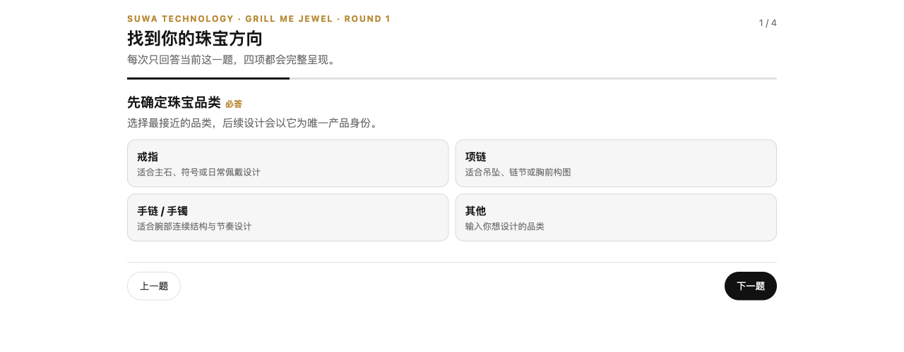
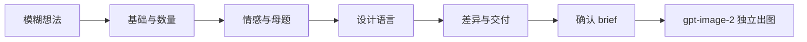

# GrillMeJewel

<p align="center">
  
</p>

<p align="center">
  <a href="LICENSE"></a>
  
  
  
  
</p>

<p align="center"><strong>把一句模糊的珠宝想法，变成一组有清晰差异的真实设计图。</strong></p>

GrillMeJewel 是苏哇科技推出的开源 Codex 插件，为珠宝创意而生。它通过简洁优雅的
Apps UI 通过四个有目的的探索阶段追问你的想法，把零散的灵感沉淀为一份清晰、专业的
珠宝设计 brief；你可以选择 1、2、4、8 张或自定义数量，确认后再由 Codex gpt-image-2
生成结构与造型都能看出差异的真实珠宝设计图。无需任何专业背景，
一句话就能开始。



<p align="center"><sub>Apps UI 访谈界面：一次只呈现一个问题，已确认的内容自动保留。</sub></p>

> 当前版本面向 **macOS 和原生 Windows 上的 Codex Desktop**。网页版、Codex Cloud
> 与远程沙箱暂不支持本地 stdio MCP 插件。

## 一句话安装

在 Codex Desktop 中新建任务，粘贴以下任一指令：

```text
/goal Read https://raw.githubusercontent.com/yuyou-dev/GrillMeJewel/main/INSTALL.md to install and verify GrillMeJewel, then create and open a new Grill Me Jewel task for me.
```

```text
/goal 阅读 https://raw.githubusercontent.com/yuyou-dev/GrillMeJewel/main/INSTALL.md，安装并验证 GrillMeJewel，然后为我创建并打开一个新的 Grill Me 珠宝任务。
```

Codex 会自动完成环境检查、插件安装与健康检查，随后提示你重启 Codex 即可使用。
完整步骤见 [INSTALL.md](INSTALL.md)。

## 一句话更新

已经安装过 GrillMeJewel？在 Codex Desktop 的新任务中粘贴：

```text
/goal Read https://raw.githubusercontent.com/yuyou-dev/GrillMeJewel/main/UPDATE.md to safely update and verify my existing GrillMeJewel installation, preserve my work, and tell me when to restart Codex.
```

```text
/goal 请阅读 https://raw.githubusercontent.com/yuyou-dev/GrillMeJewel/main/UPDATE.md，安全更新并验证我现有的 GrillMeJewel，保留我的创作内容，并告诉我何时需要重启 Codex。
```

更新器会从精确的 `v0.2.0` tag 运行可回滚迁移，不会删除对话、brief 或设计图。首次安装使用 `INSTALL.md`，已有安装使用 [UPDATE.md](UPDATE.md)。

## 它如何工作



每一轮只追问当前真正缺失的决策，绝不重复你已经说过的内容：

| 设计决策 | 示例 |
| --- | --- |
| 起点 | 一个故事、一颗宝石、一张草图，或一个纯粹的念头 |
| 产品身份 | 戒指、项链、手链、耳饰、胸针、套系，或自定义品类 |
| 设计语言 | 黄金主导、镶嵌珠宝、混合材质与其他体系 |
| 意义与风格 | 情感、场合、母题、轮廓、视觉重量与气质 |
| 材质与工艺 | 只确认真正影响设计的事实，不虚构宝石等级或品牌信息 |
| 交付意图 | 1、2、4、8 张或自定义数量，以及哪些设计轴允许拉开差异 |

## 你将获得

- 一份结构清晰、可反复打磨的珠宝设计 brief，明确区分「已锁定的事实」与「可调整的细节」。
- 经你确认后，由 gpt-image-2 生成的真实珠宝设计图。
- 多款设计逐张独立成图，每个方向至少在三个可见设计轴上拉开差异，不以拼图充数。
- 诚实可靠的交付：即使出图权限暂不可用，已确认的 brief 也会完整保留，并如实说明原因。

## 快速试用

安装并重启后，在新任务中从 Skill 选择器选择 `Grill Me 珠宝`，或者直接输入：

```text
请进入 Grill Me 珠宝模式。我想做一件送给母亲的珠宝，但现在还不知道应该设计什么。
```

```text
Grill me 珠宝。我有一颗蓝宝石，请通过表单帮我找到合适的品类和设计方向，确认后出四张差异明显的设计图。
```

## 平台支持

| 能力 | macOS | Windows | Linux | Web/Cloud |
| --- | :---: | :---: | :---: | :---: |
| 安装与健康检查 | ✅ | ✅ | 未验证 | — |
| Apps UI 与本地 MCP | ✅ | ✅ | 未验证 | — |
| gpt-image-2 生成 | ✅ | ✅ | 未验证 | — |

当前稳定版：[v0.2.0](https://github.com/yuyou-dev/GrillMeJewel/releases/tag/v0.2.0)。
升级见 [UPDATE.md](UPDATE.md)，卸载见 [INSTALL.md](INSTALL.md#uninstall)，遇到问题请查阅
[Troubleshooting](docs/TROUBLESHOOTING.md)。

## 隐私优先

GrillMeJewel 没有托管服务、数据库或账号系统——你的对话和创意只留在你自己的
设备上。Apps UI 仅用于展示问题并回传答案；图片生成完全使用你自己的 Codex 登录
与 gpt-image-2 权限，仓库中不含任何 API Key、登录凭证或用户作品。

我们同样专注于设计本身：不提供 CAD、生产参数或宝石鉴定，也不会虚构品牌与证书信息。

## 文档

- [首次安装与卸载](INSTALL.md)
- [安全更新](UPDATE.md)
- [架构与安全边界](docs/ARCHITECTURE.md)
- [故障排查](docs/TROUBLESHOOTING.md)
- [安全政策](SECURITY.md)
- [贡献指南](CONTRIBUTING.md)
- [版本变更](CHANGELOG.md)

## License 与品牌

代码基于 [Apache License 2.0](LICENSE) 开源。GrillMeJewel 由 **苏哇科技** 开发并维护。
「苏哇科技」、项目名称、图标及品牌识别不随 Apache-2.0 自动授权，详见
[TRADEMARKS.md](TRADEMARKS.md)。
