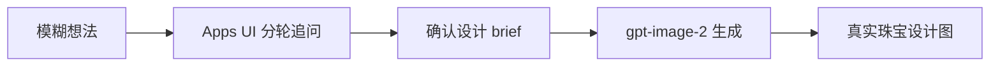

# GrillMeJewel

<p align="center">
  
</p>

<p align="center">
  <a href="LICENSE"></a>
  
  
  
  
</p>

<p align="center"><strong>把一句模糊的珠宝想法，追问成可以真正出图的设计方案。</strong></p>

GrillMeJewel 是苏哇科技推出的轻量开源 Codex 插件。它面向还不熟悉专业 brief
的新手设计师：先在对话中用简洁的 Apps UI 逐步提问，保留每轮已确认事实，形成一份
设计师可读的珠宝需求方案；确认之后，再由 Codex gpt-image-2 生成真实珠宝设计图。


<p align="center"><sub>真实 Apps UI 回放：四项问题完整保留，界面一次只呈现一题，避免对话中出现嵌套纵向滚动。</sub></p>

> 首个公开版本面向 **macOS 和原生 Windows 上的 Codex Desktop**。网页版、Codex
> Cloud 与远程沙箱不能安装本地 stdio MCP 插件。

## 一句话安装

在本地 Codex Desktop 中新建任务，发送：

```text
/goal Read https://raw.githubusercontent.com/yuyou-dev/GrillMeJewel/main/INSTALL.md to install and verify GrillMeJewel, then create and open a new Grill Me Jewel task for me.
```

中文提示词：

```text
/goal 阅读 https://raw.githubusercontent.com/yuyou-dev/GrillMeJewel/main/INSTALL.md，安装并验证 GrillMeJewel，然后为我创建并打开一个新的 Grill Me 珠宝任务。
```

Codex 会检查本机环境与权限，安装 `grill-me-jewel` marketplace 和插件，运行 doctor，
然后提示你完全重启 Codex。完整步骤见 [INSTALL.md](INSTALL.md)。

## 它如何工作



每轮只追问当前真正缺失的决策，不重复用户已经说过的内容：

| 设计决策 | 示例 |
| --- | --- |
| 起点 | 一个故事、一颗宝石、一张草图或纯粹想法 |
| 产品身份 | 戒指、项链、手链、耳饰、胸针、套系或自定义品类 |
| 设计语言 | 黄金主导、镶嵌珠宝、混合材质与其他体系 |
| 意义与风格 | 情感、场合、母题、轮廓、视觉重量和气质 |
| 材质与工艺 | 只确认真正影响设计的事实，不虚构宝石等级或品牌信息 |
| 交付意图 | 一张完整设计图，或多张相互独立的设计方向 |

## 最终得到什么

- 一份结构清晰、可继续修改的珠宝设计 brief。
- 明确区分“已经锁定的事实”和“可调整的细节”。
- 用户最终确认后生成的真实 gpt-image-2 珠宝设计图。
- 多款需求逐张生成独立图片，不用拼图代替交付。
- 出图权限不可用时保留已确认 brief，并如实说明阻塞，不把文字方案冒充视觉成果。

## 快速试用

安装并重启后，在新任务中从 Skill 选择器选择 `Grill Me 珠宝`，或者直接输入：

```text
请进入 Grill Me 珠宝模式。我想做一件送给母亲的珠宝，但现在还不知道应该设计什么。
```

```text
Grill me 珠宝。我有一颗蓝宝石，请通过表单帮我找到合适的品类和设计方向，确认后出一张设计图。
```

## 版本与平台

| 能力 | macOS | Windows | Linux | Web/Cloud |
| --- | :---: | :---: | :---: | :---: |
| 安装与 doctor | 支持 | 支持 | 未验收 | 不支持 |
| Apps UI 与本地 MCP | 支持 | 支持 | 未验收 | 不支持 |
| gpt-image-2 生成 | 支持 | 支持 | 未验收 | 不支持 |

当前稳定版：[v0.1.1](https://github.com/yuyou-dev/GrillMeJewel/releases/tag/v0.1.1)。
升级、卸载和恢复步骤见 [INSTALL.md](INSTALL.md#update) 与
[Troubleshooting](docs/TROUBLESHOOTING.md)。

## 隐私与边界

GrillMeJewel 没有托管服务、数据库或独立账号系统。Apps UI 只负责展示问题并把稳定答案
写回当前对话；图片生成使用用户自己的 Codex 登录和 gpt-image-2 权限。仓库不包含
API Key、Codex 登录文件、设计师作品、本机绝对路径或测试对话。

它不提供 CAD、生产参数、宝石鉴定或未经用户确认的品牌与证书事实。

## 项目指南

- [安装、更新与卸载](INSTALL.md)
- [架构与安全边界](docs/ARCHITECTURE.md)
- [故障排查](docs/TROUBLESHOOTING.md)
- [安全政策](SECURITY.md)
- [贡献指南](CONTRIBUTING.md)
- [版本变更](CHANGELOG.md)

## License 与品牌

代码使用 [Apache License 2.0](LICENSE)。GrillMeJewel 由 **苏哇科技** 开发并维护。
“苏哇科技”、项目名称、图标及品牌识别不由 Apache-2.0 自动授权，详见
[TRADEMARKS.md](TRADEMARKS.md)。
